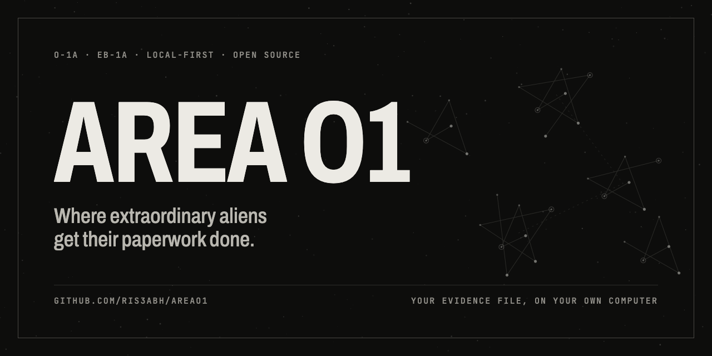
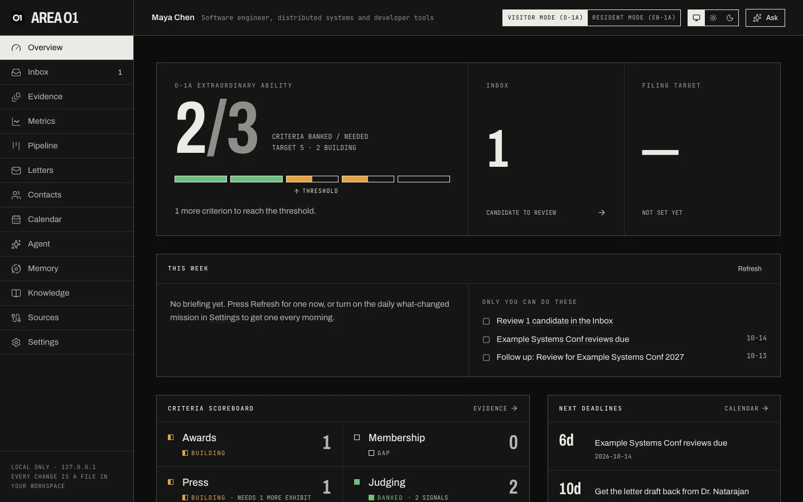

<div align="center">



# Area O1

**Your O-1A / EB-1A evidence file, built on your own computer.**

[](https://github.com/ris3abh/areao1/actions/workflows/ci.yml)
[](LICENSE)
[](https://github.com/ris3abh/areao1/releases)
[](pyproject.toml)
[](https://doi.org/10.5281/zenodo.23202416)

[**Docs**](https://ris3abh.github.io/areao1/docs/) ·
[Getting started](https://ris3abh.github.io/areao1/docs/getting-started/) ·
[Guided tour](https://ris3abh.github.io/areao1/docs/tour/) ·
[MCP](https://ris3abh.github.io/areao1/docs/mcp/) ·
[FAQ](https://ris3abh.github.io/areao1/docs/reference/faq/)



</div>

## What it does

Area O1 turns your work (papers, code, talks, press, judging) into a living evidence file for an
extraordinary-ability case. Start from your LinkedIn PDF; it takes a few minutes.

-  **A criteria scoreboard.** Every O-1A or EB-1A criterion is banked, building or a gap, by the profile's rules. An invitation never counts as a completion.
-  **An evidence inbox.** GitHub, Hugging Face, Semantic Scholar, OpenAlex, arXiv, ORCID and any web page propose evidence; nothing counts until you accept it.
-  **Memory you can trace.** Every fact is a claim quoting its source word for word, drawn as a sky you can click back to the raw page.
-  **Gmail, read-only.** Case mail sorted by rules, invitations checked against the sender and the event's official page, sends only after you approve.
-  **Rules that stay current.** Rule statements are checked against official sources that refresh when a rule actually changes.
-  **Letters from facts.** Drafts built only from approved claims, for your writers to rewrite and sign.
-  **Bring your own agent.** Chat with OpenAI, or let Claude Code and Codex read your case over MCP.

## Install in one line

macOS / Linux, in Terminal:

```sh
curl -LsSf https://raw.githubusercontent.com/ris3abh/areao1/main/install.sh | sh
```

Windows, in PowerShell:

```powershell
powershell -ExecutionPolicy ByPass -c "irm https://raw.githubusercontent.com/ris3abh/areao1/main/install.ps1 | iex"
```

It installs [uv](https://docs.astral.sh/uv/) if needed, installs Area O1 and opens it in your browser. Start it
again later with `areao1`. Read [install.sh](install.sh) or [install.ps1](install.ps1) first; they're short.
You need your LinkedIn profile as a PDF (or skip it) and, only for chat, an OpenAI API key.
More: [Getting started](https://ris3abh.github.io/areao1/docs/getting-started/).

## Connect Claude Code or Codex via MCP

```sh
claude mcp add areao1 -- areao1 mcp -w ~/AreaO1    # Claude Code
codex mcp add areao1 -- areao1 mcp -w ~/AreaO1     # Codex
```

Your agent can read the scoreboard, gaps, claims with their sources and what changed, and send notes to your
Inbox. It can't change your evidence. No API key needed.
More: [MCP and agents](https://ris3abh.github.io/areao1/docs/mcp/).

## Privacy: runs on your machine

- The dashboard is served only to your own computer (127.0.0.1). There's no Area O1 account or server.
- Your case is a private folder (`~/AreaO1`) of plain files in its own git repo. It's yours to keep, back up
  to a private remote, move or delete.
- No telemetry. Area O1 goes online only for what you connect or ask for, and to keep official rules current.
  The full list: [Privacy and security](https://ris3abh.github.io/areao1/docs/reference/privacy-security/).

## Contributing

Contributions are welcome: connectors, criteria profiles, docs. Start with [CONTRIBUTING.md](CONTRIBUTING.md)
and the [contributor docs](https://ris3abh.github.io/areao1/docs/reference/contributing/).

**Contributing *and* using Area O1 for your own case? Keep two separate repos:** your public fork of this repo
for code, and your case workspace as a fresh private repo (not a fork), in a different folder. Never copy filing
documents or personal data into the fork. [Why and how](https://ris3abh.github.io/areao1/docs/best-practices/two-repos/).

> **Not legal advice.** Area O1 is not legal advice and is not affiliated with USCIS. Criteria profiles
> are community-maintained summaries of public regulations (8 CFR 214.2(o), 8 CFR 204.5(h)). Always confirm
> strategy with an immigration attorney. See [DISCLAIMER.md](DISCLAIMER.md).

<div align="center">

[Apache-2.0](LICENSE) · Not affiliated with USCIS, the U.S. Air Force, or anything in Nevada.

</div>
